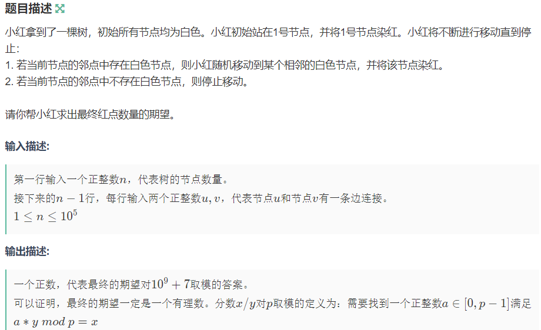

# 深度优先算法（DFS）

## 概念

通过递归的方式，不断向下探索，直到找到解，一种经典的搜索算法

## 模板

```
//首先定义剪枝函数,去除不符合条件的节点
check():
    if 满足条件: return true
    else: return false
   
//定义DFS函数 不断调用自身
dfs():
    if 找到所求解: 输出结果或进行其他操作
    if check = true:
        进行某种处理(并标记已访问)
        dfs()//调用自身 传入更新后的参数
        (回溯)
```

## 常见问题

### [USACO1.5] 八皇后 Checker Challenge

#### 题目描述

一个如下的 $6 \times 6$ 的跳棋棋盘，有六个棋子被放置在棋盘上，使得每行、每列有且只有一个，每条对角线（包括两条主对角线的所有平行线）上至多有一个棋子。


上面的布局可以用序列 $2\ 4\ 6\ 1\ 3\ 5$ 来描述，第 $i$ 个数字表示在第 $i$ 行的相应位置有一个棋子，如下：

行号 $1\ 2\ 3\ 4\ 5\ 6$

列号 $2\ 4\ 6\ 1\ 3\ 5$

这只是棋子放置的一个解。请编一个程序找出所有棋子放置的解。
并把它们以上面的序列方法输出，解按字典顺序排列。
请输出前 $3$ 个解。最后一行是解的总个数。

#### 输入格式

一行一个正整数 $n$，表示棋盘是 $n \times n$ 大小的。

#### 输出格式

前三行为前三个解，每个解的两个数字之间用一个空格隔开。第四行只有一个数字，表示解的总数。

#### 样例 #1

##### 样例输入 #1

```
6
```

##### 样例输出 #1

```
2 4 6 1 3 5
3 6 2 5 1 4
4 1 5 2 6 3
4
```

###### 提示

【数据范围】
对于 100% 的数据， 6 ≤ 𝑛 ≤ 13

#### 代码

```
//n皇后 dfs回溯
#include<bits/stdc++.h>
using namespace std;
int n,queen[15],cal;  
//判断行列是否可行
bool check(int x,int y){
	//注意i的范围 只有i<=x成立 
    for(int i=1;i<=x;i++){
        if(queen[i]==y) return false;
        if(i+queen[i]==x+y) return false;
        if(i-queen[i]==x-y) return false;
    }
    return true;
}

void search(int h){
	//printf("%d",h); 
    if(h>n){
        cal++;
        if(cal<=3){
            for(int i=1;i<=n;i++){
                printf("%d ",queen[i]);
            }
            printf("\n");
        }
    }
    //dfs
    for(int l=1;l<=n;l++){
        if(check(h,l)){
            queen[h]=l;
            //调试
			//for(int j=1;j<n;j++) printf("%d ",queen[j]); 
            search(h+1);
            queen[h]=0;
        }
    }

}

int main() {
    cin >> n;
    search(1);
    printf("%d",cal);
    return 0;
}
```

### DP+DFS

#### 问题描述



#### 题解


这段代码实现了一种基于树结构的动态规划算法，下面是详细的分析：

##### 代码结构概述：

1. **预处理与全局变量：**

   * `#include <bits/stdc++.h>`：这是一个头文件，包含了所有C++标准库，虽然方便但不建议在正式代码中使用，因为会导致编译时间变长。
   * `#define R register`：将 `register` 关键字简化为 `R`，该关键字提示编译器将变量放在寄存器中（现代编译器对该指令已自动优化）。
   * `#define int long long`：将所有 `int` 类型定义为 `long long`，以防止溢出问题，尤其是在大数运算中。
   * `const int N = 1e5 + 10;` 和 `const int mod = 1e9 + 7;`：`N` 是数组大小的上限，`mod` 是一个常用的大素数，用于取模运算，防止数据溢出。
   * `int f[N];`：这是一个全局数组，用来记录每个节点的动态规划结果。
2. **函数 `q_pow`：**

   <pre class="!overflow-visible"><div class="dark bg-gray-950 contain-inline-size rounded-md border-[0.5px] border-token-border-medium relative"><div class="flex items-center text-token-text-secondary bg-token-main-surface-secondary px-4 py-2 text-xs font-sans justify-between rounded-t-md h-9">cpp</div><div class="sticky top-9 md:top-[5.75rem]"><div class="absolute bottom-0 right-2 flex h-9 items-center"><div class="flex items-center rounded bg-token-main-surface-secondary px-2 font-sans text-xs text-token-text-secondary"><span class="" data-state="closed"><button class="flex gap-1 items-center py-1"><svg width="24" height="24" viewBox="0 0 24 24" fill="none" xmlns="http://www.w3.org/2000/svg" class="icon-sm"><path fill-rule="evenodd" clip-rule="evenodd" d="M7 5C7 3.34315 8.34315 2 10 2H19C20.6569 2 22 3.34315 22 5V14C22 15.6569 20.6569 17 19 17H17V19C17 20.6569 15.6569 22 14 22H5C3.34315 22 2 20.6569 2 19V10C2 8.34315 3.34315 7 5 7H7V5ZM9 7H14C15.6569 7 17 8.34315 17 10V15H19C19.5523 15 20 14.5523 20 14V5C20 4.44772 19.5523 4 19 4H10C9.44772 4 9 4.44772 9 5V7ZM5 9C4.44772 9 4 9.44772 4 10V19C4 19.5523 4.44772 20 5 20H14C14.5523 20 15 19.5523 15 19V10C15 9.44772 14.5523 9 14 9H5Z" fill="currentColor"></path></svg>复制代码</button></span></div></div></div><div class="overflow-y-auto p-4" dir="ltr"><code class="!whitespace-pre hljs language-cpp">int q_pow(int x, int a)
   {
   	int sum = 1;
   	while(a)
   	{
   		if(a & 1) (sum *= x) %= mod;
   		(x *= x) %= mod;
   		a >>= 1;
   	}
   	return sum;
   }
   </code></div></div></pre>

   * 这是一个快速幂算法，计算 `x` 的 `a` 次幂并取模 `mod`，时间复杂度为 O(log⁡a)O(\\log a)**O**(**lo**g**a**)。该算法通过“二进制幂乘法”来加速幂的计算。
3. **函数 `niyuan`：**

   <pre class="!overflow-visible"><div class="dark bg-gray-950 contain-inline-size rounded-md border-[0.5px] border-token-border-medium relative"><div class="flex items-center text-token-text-secondary bg-token-main-surface-secondary px-4 py-2 text-xs font-sans justify-between rounded-t-md h-9">cpp</div><div class="sticky top-9 md:top-[5.75rem]"><div class="absolute bottom-0 right-2 flex h-9 items-center"><div class="flex items-center rounded bg-token-main-surface-secondary px-2 font-sans text-xs text-token-text-secondary"><span class="" data-state="closed"><button class="flex gap-1 items-center py-1"><svg width="24" height="24" viewBox="0 0 24 24" fill="none" xmlns="http://www.w3.org/2000/svg" class="icon-sm"><path fill-rule="evenodd" clip-rule="evenodd" d="M7 5C7 3.34315 8.34315 2 10 2H19C20.6569 2 22 3.34315 22 5V14C22 15.6569 20.6569 17 19 17H17V19C17 20.6569 15.6569 22 14 22H5C3.34315 22 2 20.6569 2 19V10C2 8.34315 3.34315 7 5 7H7V5ZM9 7H14C15.6569 7 17 8.34315 17 10V15H19C19.5523 15 20 14.5523 20 14V5C20 4.44772 19.5523 4 19 4H10C9.44772 4 9 4.44772 9 5V7ZM5 9C4.44772 9 4 9.44772 4 10V19C4 19.5523 4.44772 20 5 20H14C14.5523 20 15 19.5523 15 19V10C15 9.44772 14.5523 9 14 9H5Z" fill="currentColor"></path></svg>复制代码</button></span></div></div></div><div class="overflow-y-auto p-4" dir="ltr"><code class="!whitespace-pre hljs language-cpp">int niyuan(int x)
   {
   	return q_pow(x,mod-2);
   }
   </code></div></div></pre>

   * 计算数 `x` 在模 `mod` 下的乘法逆元，利用了费马小定理，公式为 xmod−2mod  modx^{mod-2} \\mod mod**x**m**o**d**−**2**mod**m**o**d。这是因为对于质数 `mod`，amod−1≡1mod  moda^{mod-1} \\equiv 1 \\mod mod**a**m**o**d**−**1**≡**1**mod**m**o**d，因此 amod−2a^{mod-2}**a**m**o**d**−**2 是其逆元。
4. **函数 `dp`：**

   <pre class="!overflow-visible"><div class="dark bg-gray-950 contain-inline-size rounded-md border-[0.5px] border-token-border-medium relative"><div class="flex items-center text-token-text-secondary bg-token-main-surface-secondary px-4 py-2 text-xs font-sans justify-between rounded-t-md h-9">cpp</div><div class="sticky top-9 md:top-[5.75rem]"><div class="absolute bottom-0 right-2 flex h-9 items-center"><div class="flex items-center rounded bg-token-main-surface-secondary px-2 font-sans text-xs text-token-text-secondary"><span class="" data-state="closed"><button class="flex gap-1 items-center py-1"><svg width="24" height="24" viewBox="0 0 24 24" fill="none" xmlns="http://www.w3.org/2000/svg" class="icon-sm"><path fill-rule="evenodd" clip-rule="evenodd" d="M7 5C7 3.34315 8.34315 2 10 2H19C20.6569 2 22 3.34315 22 5V14C22 15.6569 20.6569 17 19 17H17V19C17 20.6569 15.6569 22 14 22H5C3.34315 22 2 20.6569 2 19V10C2 8.34315 3.34315 7 5 7H7V5ZM9 7H14C15.6569 7 17 8.34315 17 10V15H19C19.5523 15 20 14.5523 20 14V5C20 4.44772 19.5523 4 19 4H10C9.44772 4 9 4.44772 9 5V7ZM5 9C4.44772 9 4 9.44772 4 10V19C4 19.5523 4.44772 20 5 20H14C14.5523 20 15 19.5523 15 19V10C15 9.44772 14.5523 9 14 9H5Z" fill="currentColor"></path></svg>复制代码</button></span></div></div></div><div class="overflow-y-auto p-4" dir="ltr"><code class="!whitespace-pre hljs language-cpp">void dp(int x, int par, vector<vector<int>>& vrr)
   {
   	if(vrr[x].size() == 1 && vrr[x][0] == par) // 叶子节点
   	{
   		f[x] = 1;
   		return;
   	}
   	int fz = 0, fm = 0;
   	for(R int i = 0; i < vrr[x].size(); ++ i)
   	{
   		int now_node = vrr[x][i];
   		if(now_node == par) continue;
   		else ++ fm;
   		if(f[now_node] == 0) dp(now_node,x,vrr);
   		(fz += f[now_node]) %= mod;
   	}
   	f[x] = (1 + fz * niyuan(fm)) % mod;
   }
   </code></div></div></pre>

   * 这是主要的动态规划递归函数，作用是从根节点 `x` 开始，计算出每个节点的 `f[x]` 值。
   * `dp(x, par, vrr)`：`x` 是当前节点，`par` 是 `x` 的父节点，`vrr` 是邻接表表示的树。
   * 如果当前节点是叶子节点，则 `f[x] = 1`，即叶子节点的状态是 `1`。
   * 对于每个非叶子节点，首先遍历所有的子节点，跳过父节点，然后递归计算子节点的 `f` 值。
   * `fz` 是所有子节点的 `f` 值之和，`fm` 是子节点的数量。
   * 计算公式为：`f[x] = (1 + fz * niyuan(fm)) % mod`，其中 `niyuan(fm)` 表示 `fm` 的逆元。
5. **`main` 函数：**

   <pre class="!overflow-visible"><div class="dark bg-gray-950 contain-inline-size rounded-md border-[0.5px] border-token-border-medium relative"><div class="flex items-center text-token-text-secondary bg-token-main-surface-secondary px-4 py-2 text-xs font-sans justify-between rounded-t-md h-9">cpp</div><div class="sticky top-9 md:top-[5.75rem]"><div class="absolute bottom-0 right-2 flex h-9 items-center"><div class="flex items-center rounded bg-token-main-surface-secondary px-2 font-sans text-xs text-token-text-secondary"><span class="" data-state="closed"><button class="flex gap-1 items-center py-1"><svg width="24" height="24" viewBox="0 0 24 24" fill="none" xmlns="http://www.w3.org/2000/svg" class="icon-sm"><path fill-rule="evenodd" clip-rule="evenodd" d="M7 5C7 3.34315 8.34315 2 10 2H19C20.6569 2 22 3.34315 22 5V14C22 15.6569 20.6569 17 19 17H17V19C17 20.6569 15.6569 22 14 22H5C3.34315 22 2 20.6569 2 19V10C2 8.34315 3.34315 7 5 7H7V5ZM9 7H14C15.6569 7 17 8.34315 17 10V15H19C19.5523 15 20 14.5523 20 14V5C20 4.44772 19.5523 4 19 4H10C9.44772 4 9 4.44772 9 5V7ZM5 9C4.44772 9 4 9.44772 4 10V19C4 19.5523 4.44772 20 5 20H14C14.5523 20 15 19.5523 15 19V10C15 9.44772 14.5523 9 14 9H5Z" fill="currentColor"></path></svg>复制代码</button></span></div></div></div><div class="overflow-y-auto p-4" dir="ltr"><code class="!whitespace-pre hljs language-cpp">signed main()
   {
       int n;
       cin >> n;
       vector<vector<int>> vrr(n + 1);
       for(R int i = 1; i <= n - 1; ++ i)
       {
           int u, v;
           scanf("%lld%lld",&u,&v);
           vrr[u].push_back(v);
           vrr[v].push_back(u);
       }
       dp(1, -1, vrr);
       cout << f[1];
       return 0;
   }
   </code></div></div></pre>

   * 读取输入，`n` 表示树的节点数。`vrr` 是树的邻接表表示法。
   * 通过 `for` 循环读取树的边（`n-1` 条），每条边连接了两个节点 `u` 和 `v`。
   * 调用 `dp(1, -1, vrr)` 从根节点 1 开始进行动态规划。
   * 最终输出 `f[1]`，即根节点的结果。

##### 核心逻辑：

* 该代码通过动态规划的方法，自底向上地计算树中每个节点的某种状态 `f[x]`，具体计算公式为 `f[x] = (1 + 所有子节点的状态之和 / 子节点个数) % mod`。这表示了一种递归求解树上信息传递的问题。

##### 复杂度：

* 由于每个节点和每条边都只遍历一次，所以时间复杂度为 O(n)O(n)**O**(**n**)，空间复杂度为 O(n)O(n)**O**(**n**)。

##### 总结：

该代码是基于树结构的动态规划，核心是递归计算每个节点的状态，利用快速幂求模逆元来避免除法运算中的精度问题。这类代码在解决树形结构的期望、概率、dp等问题中非常常见。

#### 代码

```
#include <bits/stdc++.h>
using namespace std;
#define R register
#define int long long
const int N = 1e5 + 10;
const int mod = 1e9 + 7;
int f[N];
int q_pow(int x, int a)
{
	int sum = 1;
	while(a)
	{
		if(a & 1) (sum *= x) %= mod;
		(x *= x) %= mod;
		a >>= 1;
	}
	return sum;
}
int niyuan(int x)
{
	return q_pow(x,mod-2);
}
void dp(int x, int par, vector<vector<int>>& vrr)
{
	if(vrr[x].size() == 1 && vrr[x][0] == par) // 叶子节点
	{
		f[x] = 1;
		return;
	}
	int fz = 0, fm = 0;
	for(R int i = 0; i < vrr[x].size(); ++ i)
	{
		int now_node = vrr[x][i];
		if(now_node == par) continue;
		else ++ fm;
		if(f[now_node] == 0) dp(now_node,x,vrr);
		(fz += f[now_node]) %= mod;
	}
	f[x] = (1 + fz * niyuan(fm)) % mod;
}
signed main()
{
    int n;
    cin >> n;
    vector<vector<int>> vrr(n + 1);
    for(R int i = 1; i <= n - 1; ++ i)
    {
        int u, v;
        scanf("%lld%lld",&u,&v);
        vrr[u].push_back(v);
        vrr[v].push_back(u);
    }
    dp(1, -1, vrr);
    cout << f[1];
    return 0;
}

```

#### 相关知识点展开


##### 1. **树在代码中的存储方式：**

树可以通过邻接表（Adjacency List）来存储。在这个方法中，使用一个二维数组或 `vector` 来记录每个节点的子节点。

<pre class="!overflow-visible"><div class="dark bg-gray-950 contain-inline-size rounded-md border-[0.5px] border-token-border-medium relative"><div class="flex items-center text-token-text-secondary bg-token-main-surface-secondary px-4 py-2 text-xs font-sans justify-between rounded-t-md h-9">cpp</div><div class="sticky top-9 md:top-[5.75rem]"><div class="absolute bottom-0 right-2 flex h-9 items-center"><div class="flex items-center rounded bg-token-main-surface-secondary px-2 font-sans text-xs text-token-text-secondary"><span class="" data-state="closed"><button class="flex gap-1 items-center py-1"><svg width="24" height="24" viewBox="0 0 24 24" fill="none" xmlns="http://www.w3.org/2000/svg" class="icon-sm"><path fill-rule="evenodd" clip-rule="evenodd" d="M7 5C7 3.34315 8.34315 2 10 2H19C20.6569 2 22 3.34315 22 5V14C22 15.6569 20.6569 17 19 17H17V19C17 20.6569 15.6569 22 14 22H5C3.34315 22 2 20.6569 2 19V10C2 8.34315 3.34315 7 5 7H7V5ZM9 7H14C15.6569 7 17 8.34315 17 10V15H19C19.5523 15 20 14.5523 20 14V5C20 4.44772 19.5523 4 19 4H10C9.44772 4 9 4.44772 9 5V7ZM5 9C4.44772 9 4 9.44772 4 10V19C4 19.5523 4.44772 20 5 20H14C14.5523 20 15 19.5523 15 19V10C15 9.44772 14.5523 9 14 9H5Z" fill="currentColor"></path></svg>复制代码</button></span></div></div></div><div class="overflow-y-auto p-4" dir="ltr"><code class="!whitespace-pre hljs language-cpp">vector<vector<int>> vrr(n + 1);
</code></div></div></pre>

* 这里 `vrr[i]` 是一个列表，存储节点 `i` 的所有相邻节点（即树中的边）。
* 在输入时，通过 `vrr[u].push_back(v)` 和 `vrr[v].push_back(u)` 来添加节点之间的连接。

**特点：**

* **空间复杂度**：`O(n)`，适合存储稀疏图或树结构。
* **遍历**：可以很方便地通过 `for` 循环遍历节点的所有相邻节点。

---

##### 2. **DFS（深度优先搜索）的思路：**

DFS 是一种遍历树或图的常用算法。其基本思想是从一个节点出发，递归地访问所有的子节点。

<pre class="!overflow-visible"><div class="dark bg-gray-950 contain-inline-size rounded-md border-[0.5px] border-token-border-medium relative"><div class="flex items-center text-token-text-secondary bg-token-main-surface-secondary px-4 py-2 text-xs font-sans justify-between rounded-t-md h-9">cpp</div><div class="sticky top-9 md:top-[5.75rem]"><div class="absolute bottom-0 right-2 flex h-9 items-center"><div class="flex items-center rounded bg-token-main-surface-secondary px-2 font-sans text-xs text-token-text-secondary"><span class="" data-state="closed"><button class="flex gap-1 items-center py-1"><svg width="24" height="24" viewBox="0 0 24 24" fill="none" xmlns="http://www.w3.org/2000/svg" class="icon-sm"><path fill-rule="evenodd" clip-rule="evenodd" d="M7 5C7 3.34315 8.34315 2 10 2H19C20.6569 2 22 3.34315 22 5V14C22 15.6569 20.6569 17 19 17H17V19C17 20.6569 15.6569 22 14 22H5C3.34315 22 2 20.6569 2 19V10C2 8.34315 3.34315 7 5 7H7V5ZM9 7H14C15.6569 7 17 8.34315 17 10V15H19C19.5523 15 20 14.5523 20 14V5C20 4.44772 19.5523 4 19 4H10C9.44772 4 9 4.44772 9 5V7ZM5 9C4.44772 9 4 9.44772 4 10V19C4 19.5523 4.44772 20 5 20H14C14.5523 20 15 19.5523 15 19V10C15 9.44772 14.5523 9 14 9H5Z" fill="currentColor"></path></svg>复制代码</button></span></div></div></div><div class="overflow-y-auto p-4" dir="ltr"><code class="!whitespace-pre hljs language-cpp">void dp(int x, int par, vector<vector<int>>& vrr) {
    // x 是当前节点，par 是父节点
    for(int i = 0; i < vrr[x].size(); ++i) {
        int now_node = vrr[x][i];
        if(now_node == par) continue;  // 跳过父节点，避免走回头路
        dp(now_node, x, vrr);  // 递归访问子节点
    }
}
</code></div></div></pre>

**关键点：**

* 在递归过程中，需要通过 `par` 记录父节点，防止走回头路，避免无限循环。
* DFS 的本质是沿着每个分支进行深度遍历，直到遍历到叶子节点再回溯。

**适用场景**：

* 树形结构中的遍历、搜索、路径问题等。

---

##### 3. **DP（动态规划）在树上的思路：**

在树上进行动态规划时，通常通过 DFS 递归地处理每个节点，并根据子节点的状态计算父节点的状态。即自底向上地进行状态转移。

<pre class="!overflow-visible"><div class="dark bg-gray-950 contain-inline-size rounded-md border-[0.5px] border-token-border-medium relative"><div class="flex items-center text-token-text-secondary bg-token-main-surface-secondary px-4 py-2 text-xs font-sans justify-between rounded-t-md h-9">cpp</div><div class="sticky top-9 md:top-[5.75rem]"><div class="absolute bottom-0 right-2 flex h-9 items-center"><div class="flex items-center rounded bg-token-main-surface-secondary px-2 font-sans text-xs text-token-text-secondary"><span class="" data-state="closed"><button class="flex gap-1 items-center py-1"><svg width="24" height="24" viewBox="0 0 24 24" fill="none" xmlns="http://www.w3.org/2000/svg" class="icon-sm"><path fill-rule="evenodd" clip-rule="evenodd" d="M7 5C7 3.34315 8.34315 2 10 2H19C20.6569 2 22 3.34315 22 5V14C22 15.6569 20.6569 17 19 17H17V19C17 20.6569 15.6569 22 14 22H5C3.34315 22 2 20.6569 2 19V10C2 8.34315 3.34315 7 5 7H7V5ZM9 7H14C15.6569 7 17 8.34315 17 10V15H19C19.5523 15 20 14.5523 20 14V5C20 4.44772 19.5523 4 19 4H10C9.44772 4 9 4.44772 9 5V7ZM5 9C4.44772 9 4 9.44772 4 10V19C4 19.5523 4.44772 20 5 20H14C14.5523 20 15 19.5523 15 19V10C15 9.44772 14.5523 9 14 9H5Z" fill="currentColor"></path></svg>复制代码</button></span></div></div></div><div class="overflow-y-auto p-4" dir="ltr"><code class="!whitespace-pre hljs language-cpp">void dp(int x, int par, vector<vector<int>>& vrr) {
    if(vrr[x].size() == 1 && vrr[x][0] == par) {  // 如果是叶子节点
        f[x] = 1;
        return;
    }
    int fz = 0, fm = 0;
    for(int i = 0; i < vrr[x].size(); ++i) {
        int now_node = vrr[x][i];
        if(now_node == par) continue;
        if(f[now_node] == 0) dp(now_node, x, vrr);  // 递归计算子节点
        fz += f[now_node];
        fm++;
    }
    f[x] = (1 + fz * niyuan(fm)) % mod;  // 计算当前节点的状态
}
</code></div></div></pre>

**核心思想：**

* **状态表示**：`f[x]` 表示节点 `x` 的某个状态，通常是与子节点相关的某种值（如子树的大小、路径长度等）。
* **状态转移**：通过递归遍历子节点，将子节点的状态汇总，计算父节点的状态。
* **边界条件**：叶子节点的状态是已知的，作为递归的终止条件。

**适用场景**：

* 树形结构上的路径问题、子树大小、最优解问题等。

---

##### 4. **取模运算的思路：**

取模运算通常用于防止数据溢出或在某些问题中需要结果在一定范围内（如大数运算）。常见的是使用一个大素数 `mod` 来限制结果的大小。

**快速幂取模：** 通过快速幂法计算幂运算，同时进行取模。时间复杂度为 O(log⁡a)O(\\log a)**O**(**lo**g**a**)。

<pre class="!overflow-visible"><div class="dark bg-gray-950 contain-inline-size rounded-md border-[0.5px] border-token-border-medium relative"><div class="flex items-center text-token-text-secondary bg-token-main-surface-secondary px-4 py-2 text-xs font-sans justify-between rounded-t-md h-9">cpp</div><div class="sticky top-9 md:top-[5.75rem]"><div class="absolute bottom-0 right-2 flex h-9 items-center"><div class="flex items-center rounded bg-token-main-surface-secondary px-2 font-sans text-xs text-token-text-secondary"><span class="" data-state="closed"><button class="flex gap-1 items-center py-1"><svg width="24" height="24" viewBox="0 0 24 24" fill="none" xmlns="http://www.w3.org/2000/svg" class="icon-sm"><path fill-rule="evenodd" clip-rule="evenodd" d="M7 5C7 3.34315 8.34315 2 10 2H19C20.6569 2 22 3.34315 22 5V14C22 15.6569 20.6569 17 19 17H17V19C17 20.6569 15.6569 22 14 22H5C3.34315 22 2 20.6569 2 19V10C2 8.34315 3.34315 7 5 7H7V5ZM9 7H14C15.6569 7 17 8.34315 17 10V15H19C19.5523 15 20 14.5523 20 14V5C20 4.44772 19.5523 4 19 4H10C9.44772 4 9 4.44772 9 5V7ZM5 9C4.44772 9 4 9.44772 4 10V19C4 19.5523 4.44772 20 5 20H14C14.5523 20 15 19.5523 15 19V10C15 9.44772 14.5523 9 14 9H5Z" fill="currentColor"></path></svg>复制代码</button></span></div></div></div><div class="overflow-y-auto p-4" dir="ltr"><code class="!whitespace-pre hljs language-cpp">int q_pow(int x, int a) {
    int sum = 1;
    while(a) {
        if(a & 1) sum = (sum * x) % mod;  // 如果当前位为 1，则乘上 x
        x = (x * x) % mod;  // 平方 x
        a >>= 1;  // 右移 a
    }
    return sum;
}
</code></div></div></pre>

**乘法逆元：** 在模 `mod` 下的除法通常通过乘法逆元来实现。对于质数 `mod`，可以使用费马小定理 amod−2a^{mod-2}**a**m**o**d**−**2 来求出逆元。

<pre class="!overflow-visible"><div class="dark bg-gray-950 contain-inline-size rounded-md border-[0.5px] border-token-border-medium relative"><div class="flex items-center text-token-text-secondary bg-token-main-surface-secondary px-4 py-2 text-xs font-sans justify-between rounded-t-md h-9">cpp</div><div class="sticky top-9 md:top-[5.75rem]"><div class="absolute bottom-0 right-2 flex h-9 items-center"><div class="flex items-center rounded bg-token-main-surface-secondary px-2 font-sans text-xs text-token-text-secondary"><span class="" data-state="closed"><button class="flex gap-1 items-center py-1"><svg width="24" height="24" viewBox="0 0 24 24" fill="none" xmlns="http://www.w3.org/2000/svg" class="icon-sm"><path fill-rule="evenodd" clip-rule="evenodd" d="M7 5C7 3.34315 8.34315 2 10 2H19C20.6569 2 22 3.34315 22 5V14C22 15.6569 20.6569 17 19 17H17V19C17 20.6569 15.6569 22 14 22H5C3.34315 22 2 20.6569 2 19V10C2 8.34315 3.34315 7 5 7H7V5ZM9 7H14C15.6569 7 17 8.34315 17 10V15H19C19.5523 15 20 14.5523 20 14V5C20 4.44772 19.5523 4 19 4H10C9.44772 4 9 4.44772 9 5V7ZM5 9C4.44772 9 4 9.44772 4 10V19C4 19.5523 4.44772 20 5 20H14C14.5523 20 15 19.5523 15 19V10C15 9.44772 14.5523 9 14 9H5Z" fill="currentColor"></path></svg>复制代码</button></span></div></div></div><div class="overflow-y-auto p-4" dir="ltr"><code class="!whitespace-pre hljs language-cpp">int niyuan(int x) {
    return q_pow(x, mod - 2);  // 通过快速幂求逆元
}
</code></div></div></pre>

**关键点：**

* **取模运算**保证结果不会溢出，同时维持一定的精度。
* **逆元**允许在取模运算中进行除法操作。

**适用场景**：

* 大数运算、概率计算、组合数学等需要精度控制的场景。
