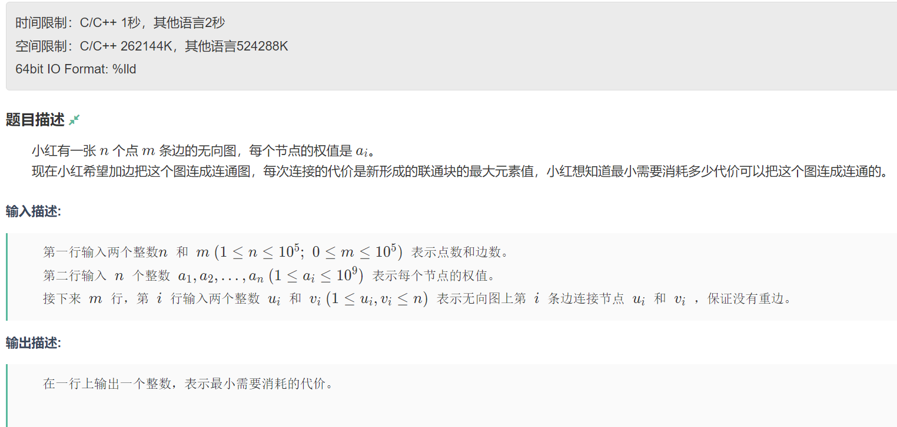

# 并查集

一种数据结构,用于处理一些不相较集合的合并问题。常用于求连通子图、最小生成树Kruskal算法和最近公共祖先。常见于图论中有关连通的问题。
其具有三种基本操作：

1. 初始化init
2. 查询find
3. 合并union
   其核心思想为路径压缩,使多个节点指向同一个最高层的父结点。

## 初始化

```
DSU(int n) {
    fa.resize(n + 1); // 父节点数组
    sz.resize(n + 1, 1); // 连通块大小数组
    iota(fa.begin(), fa.end(), 0); // 初始化父节点为自身
}
```

## 查询

```
int find(int x) {
    if (fa[x] != x) fa[x] = find(fa[x]);
    return fa[x];
}
```

## 合并

```
void merge(int x, int y) {
    int px = find(x);
    int py = find(y);
    if (px != py) {
        fa[px] = py; // 将x的连通块合并到y的连通块
        sz[py] += sz[px]; // 更新y连通块的大小
    }
}
```

## 相关例题

### 小红的图上加边

#### 题目内容



#### 思路

该题可简化为通过添加最小代价的边使得图变为连通图。每次添加一条边的代价是新形成的连通块中的最大元素值。
所以，先通过并查集管理和合并连通块，定义合并函数，依据题目要求进行，将输入的边转化为多个连通块和孤立点，并确立、存储其权值。进而对所有权值进行加和，得到转换为连通图所需代价。考虑到题目中要求最小代价，故先对权值字典进行升序排序，这样就能实现在求和中从第二小的代价开始，实现最小代价。

#### 代码

```
struct DSU {
    vector<int> fa, sz;

    // 构造函数，初始化并查集
    DSU(int n) {
        fa.resize(n + 1); // 父节点数组
        sz.resize(n + 1, 1); // 连通块大小数组
        iota(fa.begin(), fa.end(), 0); // 初始化父节点为自身
    }

    // 查找操作，带路径压缩
    int find(int x) {
        if (fa[x] != x) fa[x] = find(fa[x]);
        return fa[x];
    }

    // 判断两个节点是否在同一个连通块
    bool same(int x, int y) {
        int px = find(x);
        int py = find(y);
        return px == py;
    }

    // 合并两个节点所在的连通块
    void merge(int x, int y) {
        int px = find(x);
        int py = find(y);
        if (px != py) {
            fa[px] = py; // 将x的连通块合并到y的连通块
            sz[py] += sz[px]; // 更新y连通块的大小
        }
    }
};

void solve() {
    int n, m; 
    cin >> n >> m; // 输入节点数和边数
    vector<int> val(n + 1); // 节点权值数组
    for (int i = 1; i <= n; i++) {
        cin >> val[i]; // 输入每个节点的权值
    }
    vector<int> vis(n + 1); // 访问标记数组
    DSU dsu(n + 1); // 初始化并查集
    map<int, int> mp; // 用于记录每个连通块的最大权值

    // 处理输入的每条边
    for (int i = 1; i <= m; i++) {
        int u, v; 
        cin >> u >> v;
        dsu.merge(u, v); // 合并边u和v所在的连通块
        vis[u] = 1; // 标记节点u已访问
        vis[v] = 1; // 标记节点v已访问
    }

    vector<int> t; // 用于存储孤立点的权值
    for (int i = 1; i <= n; i++) {
        if (vis[i]) { // 如果节点i已在连通块中
            int pi = dsu.find(i); // 找到i所在连通块的根节点
            mp[pi] = max(mp[pi], val[i]); // 更新连通块的最大权值
        } else {
            t.push_back(val[i]); // 孤立点直接存入t
        }
    }

    // 将每个连通块的最大权值存入t
    for (auto [x, y] : mp) {
        t.push_back(y);
    }

    int ans = 0; // 最小代价初始化为0
    sort(t.begin(), t.end()); // 对t排序
    for (int i = 1; i < t.size(); i++) {
        ans += t[i]; // 从第二个元素开始累加，形成最小代价
    }
    cout << ans << '\n'; // 输出最小代价
}

```


