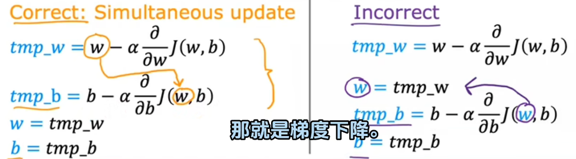

# 机器学习

## 基本概念

机器学习是AI的一个子领域,让计算机在没有明确编程的情况下学习的研究领域. 其利用了计算机善于进行重复多次试验的特性, 以"大力飞砖"的方式, 去促使计算机逐渐逼近问题最优解.

## 常用环境

Jupyter Notebook

## 相关术语

* x -- 输入变量("input variable")/特征(feature)/输入特征 表示输入的标准符号
* y -- 输出目标("output" variable)/目标变量("target" variable) 表示输出结果的标准符号
* (x, y) -- 训练例子(single training example) 在变量右上角标注"(数字i)"表示第i个训练例子
* $\hat{y}$ (y-hat) -- prediction/estimated y
* $f$ (function) -- $f_{w,b}(x)=wx+b$ "$w,b$"被称为参数/权重/系数
* 标签(lables) 一种对输出结果的标注, 或者说对输出数据的现实化, 由人为标注.
* 输出类(classes)/输出类别(category) 分类中使用, 表示输出结果, 两者含义相同.
* 二进制分类(binary classification) 输出结果二选一

## 多类特征(multiple features)

对于一个现实中的事物, 通常在其抽象化过程中, 不只含有一个特征, 所以, 我们称这种事物具有多类特征.

为了表示这种多类特征, 我们引入了线性代数中"向量"的概念.

结合前文给出概念, 对于第i个输入 $x^{(i)}$ , 有 $\vec{x}^{(i)}=[a,b,c,d]$  $a,b,c,d$ 表示多个特征对应的值. $x_{j}^{(i)}=t$ 表示第i个向量的第j个特征的值为t

在这种情况下, $f_{w,b}=w_{1}x_{1}+w_{2}x_{2}+...+w_{n}x_{n}+b$

进一步简化该公式, 令 $\vec{w}=[w_{1},w_{2},...,w_{n}]$ , 则有 $f_{w,b}=\vec{w}\cdot\vec{x}+b$

### 特征工程

对于一个具体的现实事物, 在对其进行抽象的过程中, 如何选择特征使其更加易于求解, 就是特征工程需要解决的问题.

## 主要类型

* 监督学习(Supervised learning) --使用的更多
* 无监督学习(Unsupervised learning)
* 强化学习(Reinforcement learning)

## 监督学习

给计算机提供多组多维数据, 将其中一种数据作为输出并加上标签, 计算机借此产生一种学习算法, 使其在只提供输入时可以自行给出输出结果.

核心思想为从给定正确答案中学习(learns from being given "right answers")

### 回归(regression)

从无数可能的数字中预测一个数字, 是一种由已知推出未知的思想

#### 梯度下降算法

$w=w-\alpha\frac{\partial}{\partial w}J(w,b)、b=b-\alpha\frac{\partial}{\partial b}J(w,b)$

$\alpha$ 表示学习率, 其大小的选择, 是梯度下降算法中最核心也是最重要的部分, 如果太小, 则执行速度过慢, 如果太大, 可能直接错过最小值, 称为过冲或无法收敛

对于多类特征输入变量, 有 $J(\vec{w},b)、w_{j}=w_{j}-\alpha\frac{\partial}{\partial w_{j}}J(\vec{w},b)、b=b-\alpha\frac{\partial}{\partial b}J(\vec{w},b)$

通过该函数不断循环计算, 直至函数收敛(达到局部最小值, 参数 $w,b$ 不再随着采取的每个额外步骤而发生太大变化)

值得注意的是, 即使 $\alpha$ 取定值, 随着参数不断接近局部最优, 偏导取值将随之不断减小, 抽象到图像中即为向底部滑动的速度越来越慢, 直至偏导取0, 到达最低点. 不难发现, 这种算法只能求得局部最优解. 当到达局部最优点时, 由于偏导取0, 无论 $\alpha$ 取何值, 参数都不会继续变化. 但是, 对于线性回归模型, 这种问题不会存在, 因为其代价函数一定是一个碗形函数, 只有一个全局最小值, 没有局部最小值, 这也使得梯度下降算法成为线性回归模型中的常用算法, 只要选择合适的学习率, 总能得到最优解.

*注意:* 默认情况下, 梯度下降会同时更新参数, 如果采取不同时更新的方案, 可能也能达到想要的效果, 但是其不属于梯度下降算法. 在代码实现中, 正反例子如下:

#### 线性(linear)回归模型

将一个数据集拟合成一条线性函数, 即一条直线.

##### 实现流程

1. 构造拟合函数

$f_{w,b}(x)=wx+b$

2. 代入成本函数

$J(w,b)=\frac{1}{2m}\sum_{i=1}^{m}(f_{w,b}(x^{(i)})-y^{(i)})^2$

函数为抛物面, 对函数求偏导, 偏导均等于0的点, 对应 $w,b$ 即为所求. 但是, 计算机无法直接找到函数中偏导为0的点, 所以, 就要用到 **"梯度下降"** 算法.

3. 梯度下降求$w,b$

   1. 从参数某一值开始(在线性回归模型中一般取参数为0为初始点), 将其代入 $w,b$
   2. 不断改变 $w,b$ 的值, 朝着能"最高效"减小 $J(w,b)$ 的方向前进, 该方向即为梯度下降的方向, 它代表着当前点向任意方向前进时, 能够使函数值下降最多的方向.
   3. 直到达到或者接近 $\min{J(w,b)}$ .

   *注意:* 对于有多个局部最低点的函数, 梯度下降法并不保证能找到全局最低点. 相关数学公式及证明见上文.

#### 多项式回归(polynomial regression)

一种非线性回归模型, 可以更灵活地拟合函数.

### 分类(classification)

只预测一小部分可能的输出或类别, 分类通常只有两个至多个输出, 分类的对象不仅限于数字.

当输出数据不止一个时, 学习算法实际上是在寻找一个边界线(boundary)拟合到这些数据上, 进而区分不同的输出结果.

#### Logistic回归

## 无监督学习

相较于监督学习, 其不给出标签(labels), 仅仅是给出多组数据, 所以, 这种ML更专注于分析对于某个特定的数据集, 其是否存在某种模式或结构.

核心思想为获取没有标签的数据并尝试自动将他们分组到集群中.

考虑到加标签需要消耗人力与物力, 使用无监督学习去节省时间与精力.

* 聚类算法

无监督学习算法可能将数据分配给两个至多个不同的组或集群——聚类算法.

* 异常检测
