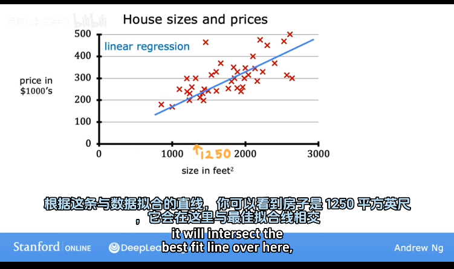

# 机器学习

## 基本概念

机器学习是AI的一个子领域,让计算机在没有明确编程的情况下学习的研究领域. 其利用了计算机善于进行重复多次试验的特性, 以"大力飞砖"的方式, 去促使计算机逐渐逼近问题最优解.

## 常用环境

Jupyter Notebook

## 相关术语

### 标签(lable)

一种对输出结果的标注, 或者说对输出数据的现实化, 由人为标注.

### 输出类(classes) 输出类别(category)

分类中使用, 表示输出结果, 两者含义相同.

## 主要类型

* 监督学习(Supervised learning) --使用的更多
* 无监督学习(Unsupervised learning)
* 强化学习(Reinforcement learning)

## 监督学习

给计算机提供多组多维数据, 将其中一种数据作为输出并加上标签, 计算机借此产生一种学习算法, 使其在只提供输入时可以自行给出输出结果.

核心思想为从给定正确答案中学习(learns from being given "right answers")

### 回归(regression)

从无数可能的数字中预测一个数字, 是一种由已知推出未知的思想

#### 线性回归模型

将一个数据集拟合成一条线性函数, 即一条直线.

### 分类(classification)

只预测一小部分可能的输出或类别, 分类通常只有两个至多个输出, 分类的对象不仅限于数字.

当输出数据不止一个时, 学习算法实际上是在寻找一个边界线(boundary)拟合到这些数据上, 进而区分不同的输出结果.

## 无监督学习

相较于监督学习, 其不给出标签(labels), 仅仅是给出多组数据, 所以, 这种ML更专注于分析对于某个特定的数据集, 其是否存在某种模式或结构.

核心思想为获取没有标签的数据并尝试自动将他们分组到集群中.

考虑到加标签需要消耗人力与物力, 使用无监督学习去节省时间与精力.

* 聚类算法

无监督学习算法可能将数据分配给两个至多个不同的组或集群——聚类算法.

* 异常检测
